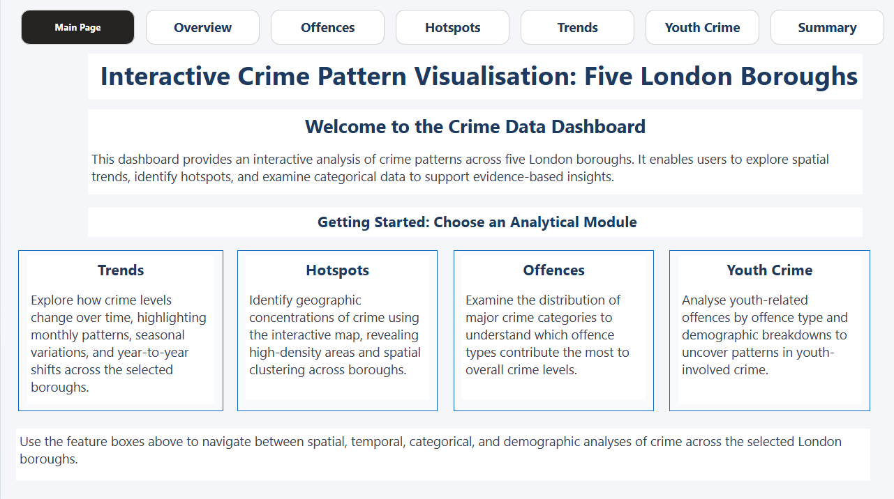
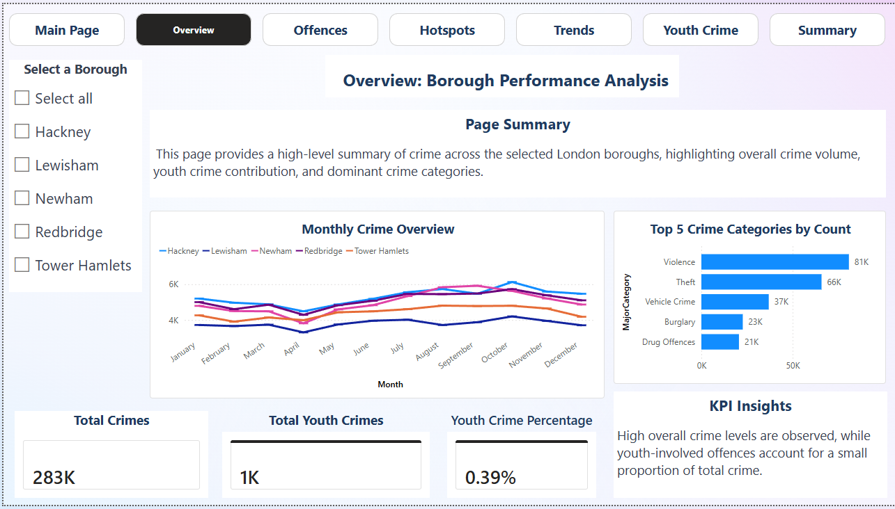
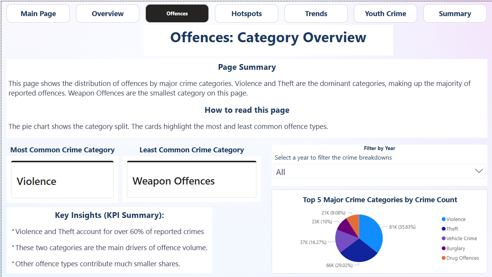
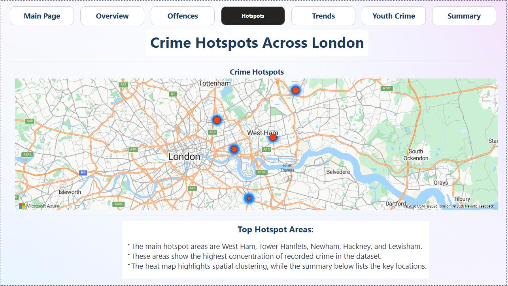
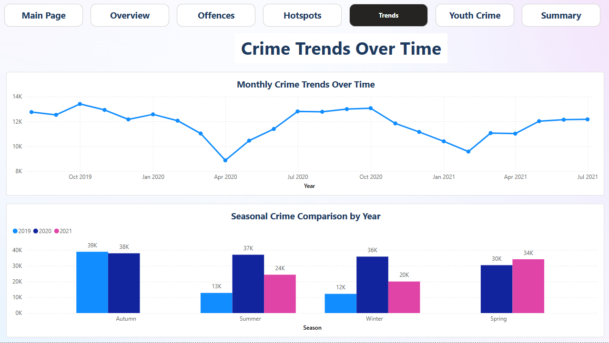
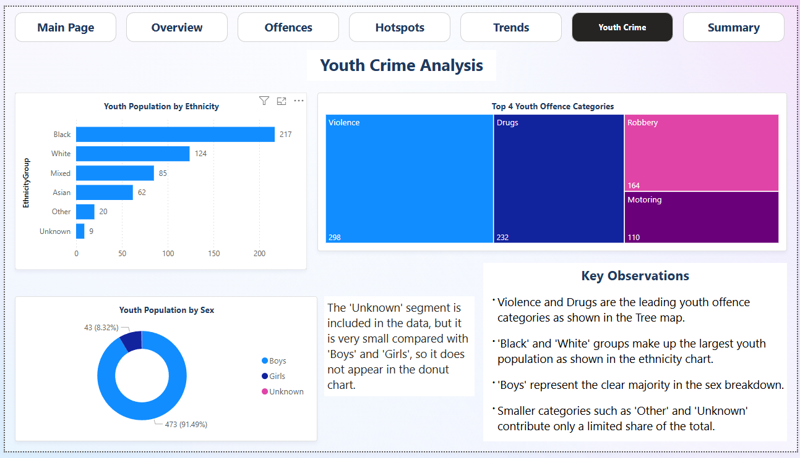
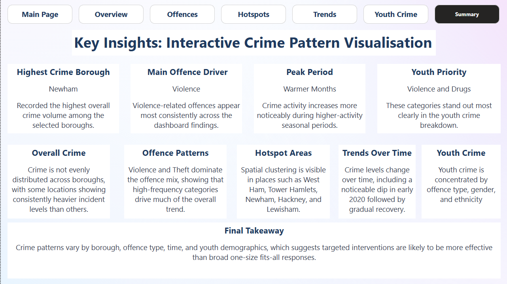

# Interactive Crime Pattern Visualisation: Five London Boroughs

A multi-page Power BI dashboard analysing crime patterns across five London boroughs — Newham, Redbridge, Hackney, Tower Hamlets, and Lewisham — built as part of my BSc (Hons) Data Science & AI final year project at the University of East London (First Class, 94%).

> **Note:** The original `.pbix` file is no longer available. This repo showcases the dashboard through screenshots, along with a summary of the data pipeline, analytical approach, and key findings.

---

## Project Objective

To analyse and compare crime patterns across five London boroughs using publicly available datasets, through the design of a multi-page interactive dashboard that visualises key trends, offence categories, and geographic hotspots — supporting public understanding and evidence-based insight into urban crime.

The project paid particular attention to **youth-related crime**, examining how it compared demographically and categorically against overall recorded crime.

---

## Data Sources

Three publicly available, fully anonymised and aggregated datasets were used:

- **Metropolitan Police Service (MPS) crime data** — aggregated at **LSOA level** (Lower Super Output Area), for fine-grained spatial analysis
- **MPS crime data** — aggregated at **ward level**, for broader spatial comparison across boroughs
- **Youth Justice statistics** (Ministry of Justice) — borough-level annual data on offences committed by individuals aged 10–17

All datasets were anonymised and geo-masked prior to release, in line with police.uk data protection standards.

---

## Tools & Skills Used

| Stage | Tools |
|---|---|
| Data preprocessing & ETL | Python (pandas, numpy) in Google Colab |
| Feature engineering | Derived temporal fields (year, month, quarter, season, weekend flag), harmonised spatial identifiers |
| Data modelling | Star schema relational model in Power BI (fact/dimension tables linked via surrogate keys) |
| Dashboard development | Power BI Desktop |
| Calculated metrics | DAX measures (total crimes, youth crime %, most/least common offence category) |
| Usability testing | Microsoft Forms survey (peer + expert evaluation, 26 valid responses) |

The full Python ETL script and DAX measures are documented in the dissertation report, available in this repo.

---

## Dashboard Structure

The dashboard was built as a 7-page interactive tool:

1. **Main Page** — navigation hub, project overview
2. **Overview** — high-level KPIs, top 5 crime categories, monthly trend by borough
3. **Offences** — category breakdown by offence type, year filter
4. **Hotspots** — geographic clustering via interactive map
5. **Trends** — monthly and seasonal crime patterns over time
6. **Youth Crime** — demographic breakdown (ethnicity, sex) and offence type analysis for youth-related crime
7. **Summary** — consolidated key insights and final takeaways

---

## Dashboard Walkthrough

### 1. Main Page

Entry point to the dashboard, guiding users to the four core analytical modules: Trends, Hotspots, Offences, and Youth Crime.

### 2. Overview

High-level summary across all five boroughs: **283K total recorded crimes**, with **Violence (~81K)** and **Theft (~66K)** as the dominant offence categories. Youth-related crime accounted for just **0.39%** of the total, indicating that overall crime patterns were largely driven by adult offending.

### 3. Offences

Violence and Theft together made up **over 60% of all reported crime**, consistent with Broken Windows Theory — where frequent lower-level offences contribute to broader patterns of visible disorder. Weapon Offences were the smallest recorded category.

### 4. Hotspots

Spatial analysis revealed clear clustering rather than an even distribution — crime was concentrated in **West Ham, Tower Hamlets, Newham, Hackney, and Lewisham**, aligning with Crime Pattern Theory's concept of offenders operating within familiar "activity spaces."

### 5. Trends

Crime levels declined sharply in early 2020 (coinciding with COVID-19 lockdowns — consistent with Routine Activity Theory, where reduced mobility disrupted the convergence of offenders and opportunity) before gradually recovering through 2020–2021. Seasonal analysis showed higher crime in more active periods such as autumn.

### 6. Youth Crime

Youth offending was dominated by **Violence and Drugs** as the leading categories, followed by Robbery and Motoring Offences. Boys represented a substantial majority of recorded youth crime cases. Black and White ethnicity groups comprised the largest shares of the youth population represented in the data.

### 7. Summary

**Newham** recorded the highest overall crime volume of the five boroughs. The consolidated takeaway: crime patterns vary significantly by borough, offence type, time, and youth demographics — suggesting that **targeted, context-specific interventions** are likely to be more effective than uniform, borough-wide responses.

---

## Key Insights

- Violence and Theft are the primary drivers of overall crime volume across all five boroughs, together accounting for **60%+** of recorded offences
- Crime is spatially concentrated rather than evenly distributed — **West Ham, Tower Hamlets, Newham, Hackney, and Lewisham** are consistent hotspot areas
- Recorded crime dipped sharply in **early 2020** and gradually recovered through 2021, reflecting the impact of pandemic-related mobility restrictions
- **Newham** recorded the highest overall crime volume among the five boroughs
- Youth-related crime, while a small proportion (0.39%) of total recorded crime, shows distinct patterns — dominated by Violence and Drug offences

---

## Usability Evaluation

The dashboard was evaluated through a structured **Microsoft Forms survey** with 26 valid responses from peer and expert participants, following recorded walkthrough videos of each page.

- **Navigation & structure:** strong agreement that navigation was clear, logical, and predictable
- **Visual clarity:** high agreement across Overview, Offences, Trends, Youth Crime, and Summary pages
- **Areas for refinement:** some feedback on the Hotspots map (label clarity, colour contrast) and a preference for shorter, more digestible text blocks on the Summary page

Peer feedback focused on usability and interface design; expert feedback focused more on analytical framing, chart selection, and interpretability — together providing a balanced, complementary evaluation.

---

## Theoretical Framework

The analysis was grounded in environmental criminology, drawing on:
- **Routine Activity Theory** (Cohen & Felson, 1979) — for interpreting temporal crime patterns
- **Crime Pattern Theory** (Brantingham & Brantingham, 1993/1995) — for interpreting spatial clustering
- **Broken Windows Theory** (Kelling & Wilson, 1982) — for interpreting offence category composition

---

## Repo Contents

```
├── README.md
├── screenshots/
│   ├── 01-main-page.png
│   ├── 02-overview-page.png
│   ├── 03-offences-page.png
│   ├── 04-hotspots-page.png
│   ├── 05-trends-page.png
│   ├── 06-youth-crime-page.png
│   └── 07-summary-page.png
```

---

## About

Built by **Anwesha Mohanty** as a final year dissertation project (CN6000), BSc (Hons) Data Science & Artificial Intelligence, University of East London — supervised by Ragulgowtham Panneer Selvam. Graded **94%**.
